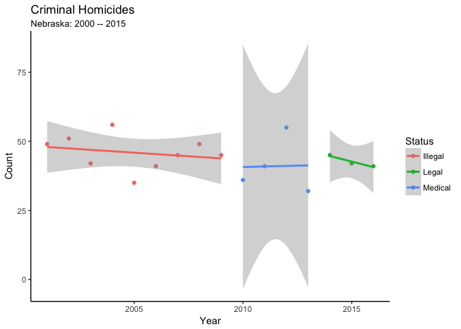

Cornhusker Crime Data and the Legalization of Marijuana in The Centenial State
================
John R. Brandon, PhD
2017-03-21

It seems that the storm of U.S. political news has been unavoidable recently. The stakes are high under the new Republican Administration. It only took one executive order before the Federal District Courts began to restrain the administration from constitutional overreach.

This document was motivated by comments Attorney General Jeff Sessions (AL) made recently regarding marijuana. Context is provided on Nebraska's role as an opponent of legalization in the courts, and background is provided regarding Session's recent comments proposing a link between marijuana and violent crime.

This letter will examine crime data from Nebraska with an eye on the marijuana legalization timeline of bordering state Colorado. Of particular interest is the question, "Are there trends in Nebraska crime through time, and if so, do they correspond with the timeline of legalization in Colorado?"

Nebraska and Oklahoma *v* Colorado: 2014 -- 2016
------------------------------------------------

The legalization of marijuana at the state level could be another consistutional issue put before the courts in the near future. Nebraska and Oklahoma tried to bring a suit before the U.S. Supreme Court against Colorado during 2014 -- 2016. This attempt started the same year Colorado put regulations for recreational pot into effect, ammending the state constitution in the process.

Attorney Generals Doug Peterson (NE) and E. Scott Pruit (OK; now the head of the EPA) argued that Colorado's pot was being smuggled across state lines and claimed this led to an increase in other crimes in the states. The Supreme Court ultimately declined to consider the matter (6 -- 2), with Justices Thomas and Alito dissenting that such matters were under the court's constitutional jurisdiction.

Reefer Madness and the Agents of :tangerine:
--------------------------------------------

After his nomination to U.S. Attorney General, [Jeff Sessions](https://en.wikipedia.org/wiki/Jeff_Sessions) has made it clear he wants the Department of Justice to be 'Tough on Crime' under his watch. This is a central theme of the administration. He has also repeatedly mentioned marijuana.

Session's rhetoric indicates his DOJ will be looking to take a harder line against state legalized marijuana than was taken under the previous administration's more hands off approach. Sessions has compared marijuana as ["only slightly less awful" than herion](http://time.com/4703888/jeff-sessions-marijuana-heroin-opioid/).

It was Sessions' recent comments linking marijuana and violent crime, however, that led me to a well researched article on Snopes.com by [Alex Kasprak](http://www.snopes.com/author/alex/). Kasprak presents interesting background into Session's claim, and cites published scientific research based on the legalization of medical marijuana that is contrary to Session's claims; ultimately concluding that [Jeff Session's comments linking marijuana and violent crime are false.](http://www.snopes.com/marijuana-legalization-violent-crime/).

\[As far as I can tell, the published science Kasprak cites are all studies focused on medical marijuana. That makes sense because medical marijuana has been legalized in more states than recreational marijuana, and for a longer period of time. The sample size for medical marijuana is larger than it is for recreational marijuana in the U.S.\]

BadCornHusker.csv
-----------------

Introduce publically available crime data, *e.g.* `.dat\BadCornHusker.csv` here:

``` r
# Packages
library(tidyverse)  # For wrangling data
library(lubridate)  # Dates and times
library(purrr)      # Mapping functions to each element of a vector

# Read Nebraska crime data and glimpse -----------------------------------------
badcorn_wide = read_csv(file = "./dat/BadCornHusker.csv")

# Glimpse data
badcorn_wide  
```

    ## # A tibble: 31 × 18
    ##                Offense Violent `2000` `2001` `2002` `2003` `2004` `2005`
    ##                  <chr>   <lgl>  <int>  <int>  <int>  <int>  <int>  <int>
    ## 1              Unknown      NA      4      4      5      3      9      6
    ## 2    Criminal_Homicide    TRUE     49     51     42     56     35     41
    ## 3  Death_by_Negligence      NA     16     22     24     20     15     21
    ## 4        Forcible_Rape    TRUE    158    156    155    157    200    169
    ## 5              Robbery    TRUE    316    282    331    282    317    324
    ## 6   Aggravated_Assault    TRUE    959    895    849    876   1044   1274
    ## 7             Burglary   FALSE   1196   1033   1015   1031   1012    965
    ## 8              Larceny   FALSE   9904   9797   9315   8256   8795   8468
    ## 9  Motor_Vehicle_Theft   FALSE    471    558    530    457    399    370
    ## 10      Simple_Assault    TRUE  10229   9809   9838   9589   9607   9975
    ## # ... with 21 more rows, and 10 more variables: `2006` <int>,
    ## #   `2007` <int>, `2008` <int>, `2009` <int>, `2010` <int>, `2011` <int>,
    ## #   `2012` <int>, `2013` <int>, `2014` <int>, `2015` <int>

``` r
# Define a function to map legal status to year --------------------------------
legality = function(year) {
  if (year < 2009) {
    "Illegal"
  } else if (year <= 2012) {
    "Medical"
  } else {
    "Legal"
  }
}
```

``` r
# Wrangle data before plotting -------------------------------------------------
badcorn_long = badcorn_wide %>%
  # Gather table from wide to long
  gather(key = yr, value = Count, -Offense, -Violent) %>%
  # Format yr as POSIXct date
  mutate(Year = paste(yr, "12", "31", sep = "-"),
         Year = ymd(Year)) %>%
  # Map legal status to year
  mutate(Status = map_chr(.x = yr, .f = legality),
         Legal = ifelse(Status != "Illegal", TRUE, FALSE)) %>%
  mutate(Offense = as.factor(Offense))

# Glimpse data
badcorn_long
```

    ## # A tibble: 496 × 7
    ##                Offense Violent    yr Count       Year  Status Legal
    ##                 <fctr>   <lgl> <chr> <int>     <date>   <chr> <lgl>
    ## 1              Unknown      NA  2000     4 2000-12-31 Illegal FALSE
    ## 2    Criminal_Homicide    TRUE  2000    49 2000-12-31 Illegal FALSE
    ## 3  Death_by_Negligence      NA  2000    16 2000-12-31 Illegal FALSE
    ## 4        Forcible_Rape    TRUE  2000   158 2000-12-31 Illegal FALSE
    ## 5              Robbery    TRUE  2000   316 2000-12-31 Illegal FALSE
    ## 6   Aggravated_Assault    TRUE  2000   959 2000-12-31 Illegal FALSE
    ## 7             Burglary   FALSE  2000  1196 2000-12-31 Illegal FALSE
    ## 8              Larceny   FALSE  2000  9904 2000-12-31 Illegal FALSE
    ## 9  Motor_Vehicle_Theft   FALSE  2000   471 2000-12-31 Illegal FALSE
    ## 10      Simple_Assault    TRUE  2000 10229 2000-12-31 Illegal FALSE
    ## # ... with 486 more rows

``` r
# First look at criminal homicides ---------------------------------------------
badcorn_long %>% filter(Offense == "Criminal_Homicide") %>%
  ggplot(aes(x = Year, y = Count, color = Status)) +
  theme_classic() +
  geom_point() +
  stat_smooth(method = lm) +
  labs(title = "Criminal Homicides",
       subtitle = "Nebraska: 2000 -- 2015")
```


